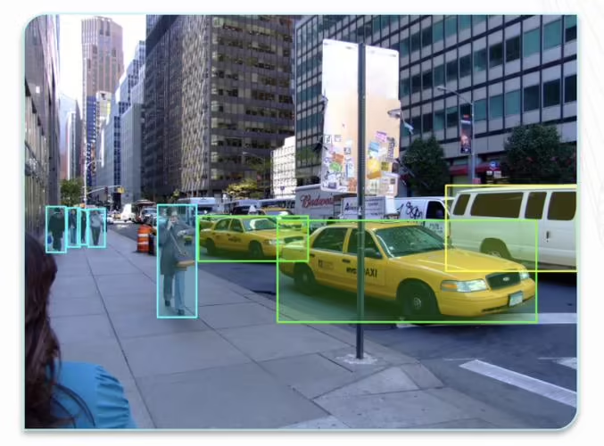
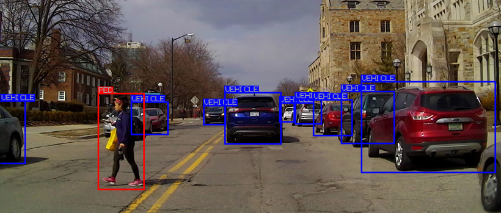
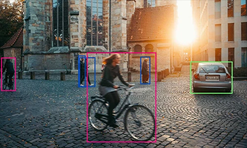
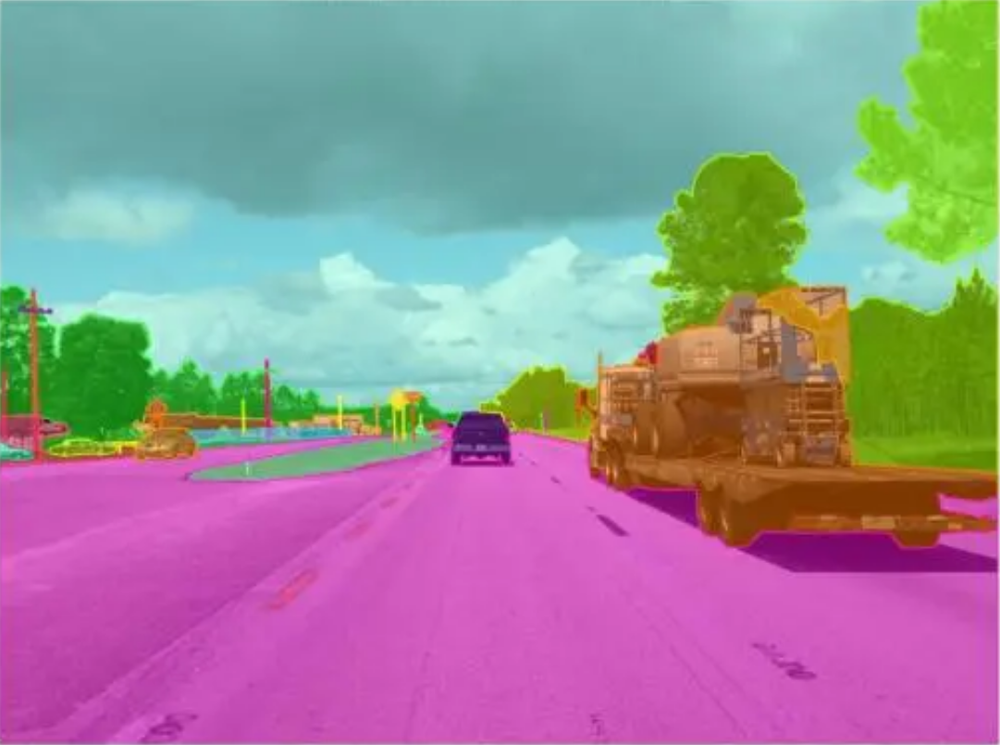
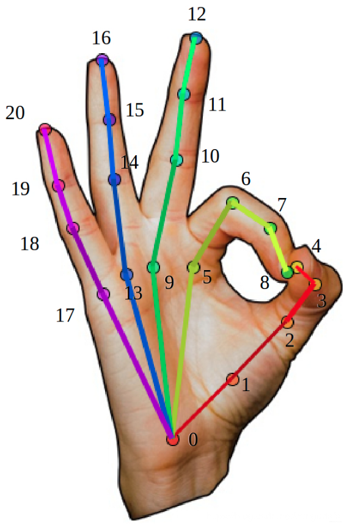
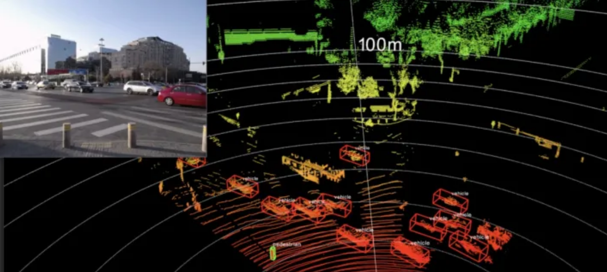
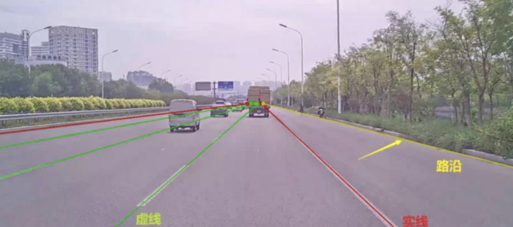

# Data Annotation Promotion

* [中文 Chinese](../README.md)
* [英文 English]()

## E-Mails（Please indicate EnjoyAI by e-mail）
* tingting.zhao@knockknock.cn
## Contents
  - [1、Detect Bounding Box](#1a)
  - [2、Semantic Segmentation](#2a)
  - [3、Instance Segmentation](#3a)
  - [4、Key point detection](#4a)
  - [5、3D point cloud annotation](#5a)
  - [6、Lane marking](#6a)
---

### Choose the right AI big model data service provider to accelerate your AI application development. We will provide you with high-quality data acquisition, cleaning, labeling, and large model training services to make your AI applications faster, more accurate, and more professional. Customized service model to meet your specific needs, improve your business efficiency and competitiveness. Choose us, choose the industry's leading AI data service provider.

# Our Advantages

## 1.annotation task docking, can help sort out the needs, provide annotation solutions.

## 2. support short and fast labeling tasks,

* Short: Fast and flexible, we can support as little as "1 person/day", more than "10 people/day" standard tasks, for a large number of tasks can be completed within a week to complete the deployment of 200 annotated personnel.

* Ping: Stable quality assurance, we have professional label quality inspection support.

* Fast: After the annotation data is completed and the quality inspection is completed, the fastest return to the customer.

## 3. data collection

* The platform supports the collection, acquisition, recording, preservation and processing of various types of data for subsequent data analysis, data mining, machine learning and artificial intelligence. By optimizing the efficiency of the platform, reducing the collection cost, machine-assisted collection and other means, the cost is reduced by more than 50%.

## 4.customized annotation for different tasks

* A) Supports the configuration of points, straight lines, dashed lines, Bezier curves, rectangles, polygons, labels, and can be configured for function expansion.

* B) Perfect quality system and labeling scheme, comprehensive and multi-directional protection of data quality and data security

* C) Able to provide customers with labeling schemes and services in various aspects and styles, with different labeling tools and attributes for different projects.

* D) Configurable annotation tools to quickly meet different customized needs of customers.

## 5.intelligent assisted analysis annotation

* Use machine learning algorithms to analyze and process collected, labeled, and cleaned data to build models for more accurate pre-labeling. The auxiliary manual for semi-automatic labeling, classification or annotation improves the labeling efficiency by more than 60%.

## 6. flexible task mechanism

* We can serve a variety of tasks to mark tasks.

## 7. data use examples of support and consulting services

* Deep learning for routine tasks uses framework adaptations

    

  

  ## 1、Detect Bounding Box

      

  ### 
figure-1

     

  ### 
figure-2

    

  ### 
figure-3

  

  ## 2、Semantic Segmentation

  

  ### 
figure-4

  

  ### 
figure-5

  

  ## 3、Instance Segmentation

  

  ### 
figure-6

  

  ## 4、Key point detection

  

  ### 
figure-7

  

  ### 
figure-8

  

  ### 
figure-9

  

  ## 5、3D point cloud annotation

  

  ### 
figure-10

  

  ### 
figure-11

  

  ## 6、Lane marking

  

  ### 
figure-12

  

  ### 
figure-13

