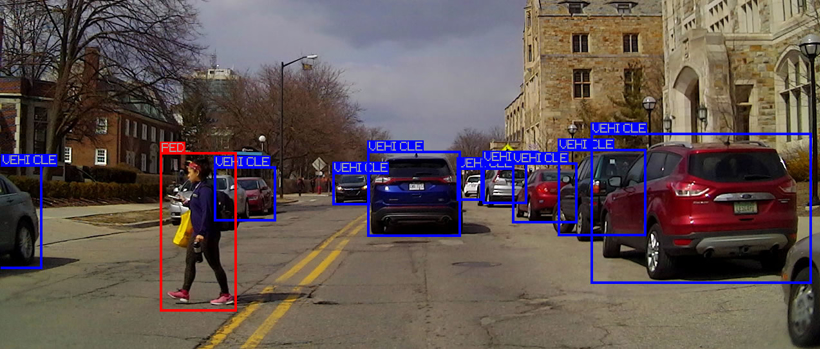
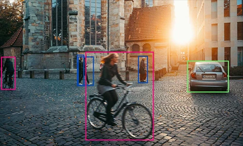
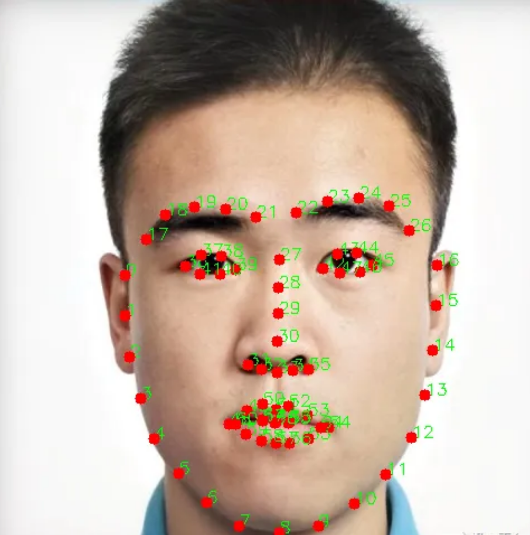
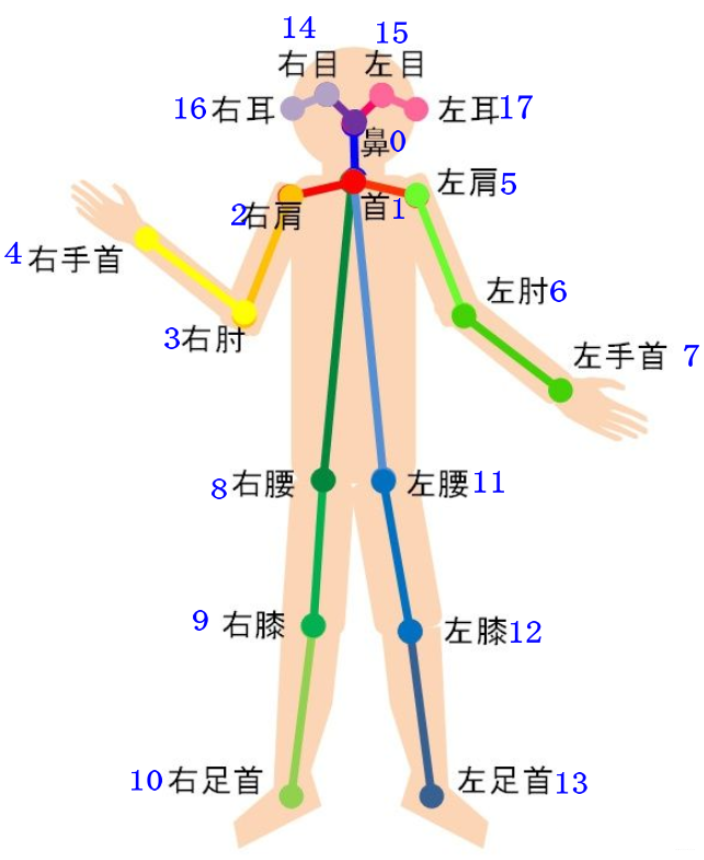
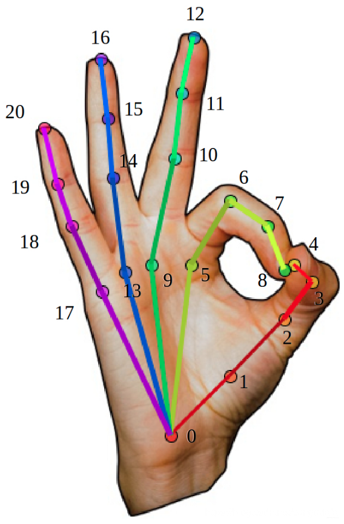
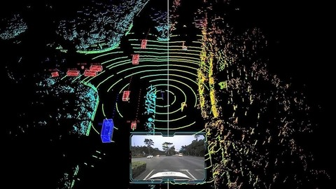
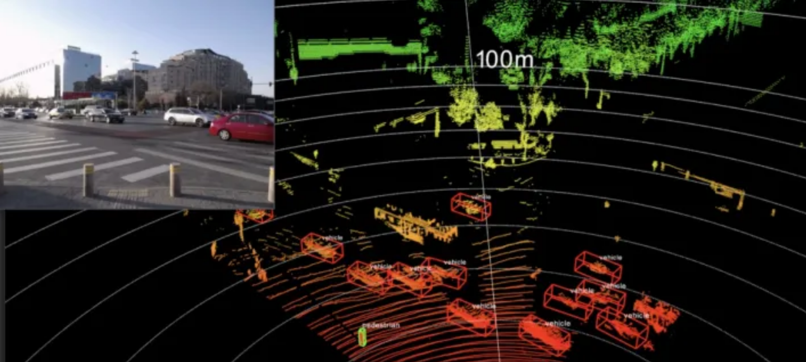
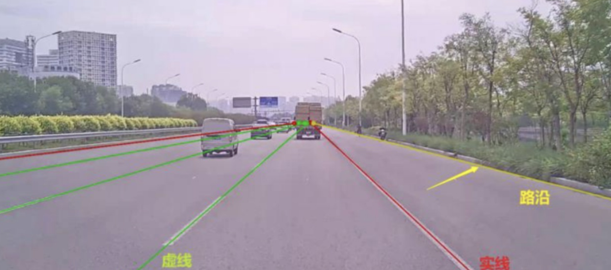
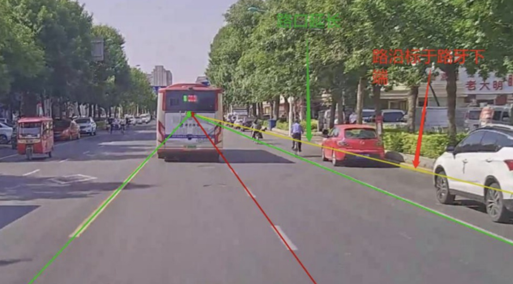

# 数据推广服务（Data Annotation Promotion）

* [中文 Chinese]()
* [英文 English](/English/English.md)

## 联系方式

---
### 目录

  - [1、检测框标注](#1a)
  - [2、语义分割标注](#2a)
  - [3、实例分割标注](#3a)
  - [4、关键点检测](#4a)
  - [5、3D点云标注](#5a)
  - [6、车道线标注](#6a)

### 选对人工智能大模型数据服务提供商，加速您的人工智能应用开发。我们将为您提供高质量的数据采集、清洗、标注和大模型训练服务，让您的人工智能应用变得更快、更准确、更专业。定制化服务模式 满足您的专属需求，提高您的业务效率和竞争力。选择我们，选择行业领先的人工智能数据服务提供商。

# 我们的优势

## 1、数据采集
* 平台支持收集、获取、记录、保存和处理各种类型的数据，以用于后续的数据分析、数据挖掘、机器学习和人工智能等领域。通过优化平台效率、降低采集成本、机器辅助采集等手段成本降低50%以上。

## 2、针对不同任务定制化标注
* A) 支持点、直线、虚线、贝塞尔曲线、矩形、多边形、标签的配置，可配置化进行功能扩展。
* B) 完善的质量体系和标注方案，全面且多方位的保障数据的质量及数据安全性
* C) 能够全方位，多样式为客户提供标注方案及服务，针对不同的项目有不同的标注工具和属性。
* D) 配置式标注工具，快速满足客户不同的定制化需求。

## 3、智能辅助分析标注
* 使用机器学习算法，对采集、标注和清洗后的数据进行分析和处理，构建模型，实现更精确的预标注。半自动标记、分类或注释的辅助人工，标注效率提升60%以上。

## 4、灵活的任务机制
* 我们可服务于不同任务量得标注任务。

## 5、数据集的积累
* 有······ 数据积累

## 6、数据使用范例的支持和咨询服务
* 常规任务的深度学习使用框架适配

---

    

## 1、检测框标注
    

### 
图1

    

### 
图2

### 
图3

   

## 2、语义分割标注

### 
图4

### 
图5

    

## 3、实例分割标注

### 
图6

    

## 4、关键点检测

### 
图7

### 
图8

### 
图9

    

## 5、3D点云标注

### 
图10

### 
图11

    

## 6、车道线标注

### 
图12

### 
图13

